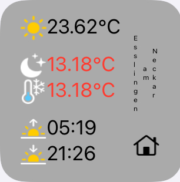
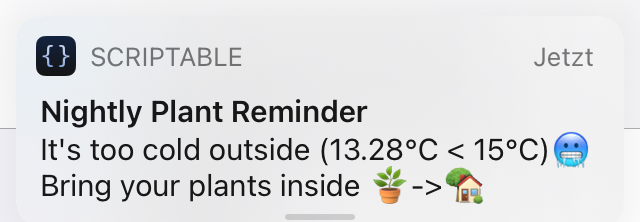
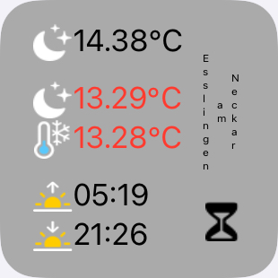
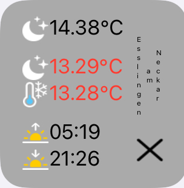
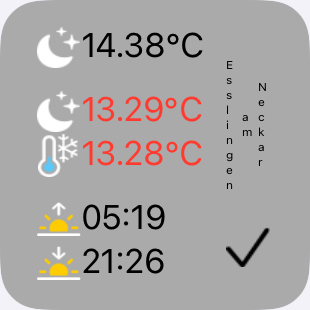
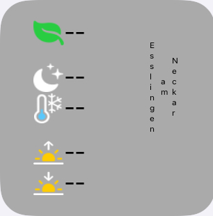

# :leaves: nightly-plant-reminder-widget

This widget reminds you to bring your plants inside in case it's too cold outside.

## Design

The widget displays the current temperature (in degree Celcius) and the current weather condition at the top.</br>
The expected temperature at night and the minimum temperature are displayed below. These are displayed in red if they are less than the low-temperature.</br>
In addition, the time of sunrise and sunset are displayed below.</br>
The current location of the shown weather data is displayed on the right.</br>
An image in the bottom left displays the status of the widget.</br></br>

## Functionality
This widget reminds you at night-time (after sunset), to bring your plants inside, in case the expected daily minimum or the nightly temperature is less than the accepted low-temperature. The low-temperature can be provided to the widget, or the default low-temperature (15°C) will be used. The weather data is provided by https://openweathermap.org/.</br>
During day-time, the widget displays in the bottom left what to expect at night. The image of a house :house: indicates that it will be too cold outside for the plants and that they need to be brought inside. No image indicates that the daily minimun or nightly temperature is expected to be above the low-temperature.</br>

Once night-time is reached and it is too cold outside, a notification is scheduled:</br>
</br>

From now on either an hour-glass, a x-mark or a check-mark are displayed in the bottom left:</br>
:hourglass: The hour-glass indicates that a notification was send.</br>
:x: The x-mark indicates that the notification was not resolved yet. A new notification will bew send the earliest after 10 minutes.</br>
:heavy_check_mark: The check-mark indicates that the notification was resolved and the plants are safely inside.</br>
&nbsp;&nbsp;
&nbsp;&nbsp;
&nbsp;&nbsp;&nbsp;&nbsp;
</br>
If your phone has no internet connection or if the weather data could not be loaded, the last widget screen from above is shown. If the location could not be determined, no current location is displayed.

## Requirements
* Apple Device with iOS 14.
* Scriptable latest (https://scriptable.app/).

## Setup
1. Copy the source code for ```nightly-plant-reminder-widget.js``` ("raw").
2. Open Scriptable.
3. Select "+" and insert the copy of the script.
4. Choose the title of the script (e. g. Nightly Plant Reminder).
5. Save with "Done".
6. Go back to the iOS Homescreen and get into the "wiggle mode".
7. Press the "+" symbol and look for "Scriptable".
8. Choose widget size (small) and "Add widget".
9. Go into the settings of the widget to edit it.
   * Choose script of step #4.
   * Provide the low-temperature in degree Celcius (default is 15°C)


**Enjoy the widget!**
